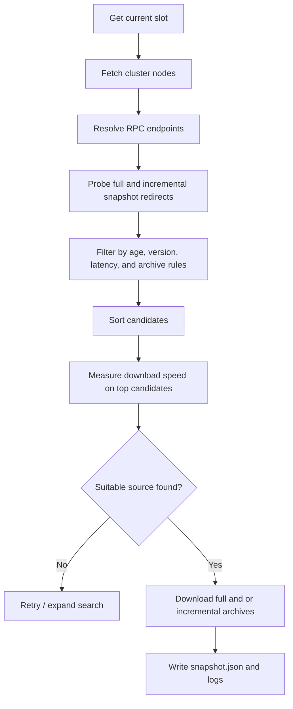

# solana-snapshot-finder

Fast snapshot discovery and download for Solana validators.

`solana-snapshot-finder` discovers snapshot sources from validator RPC endpoints, filters them by freshness and latency, measures real download speed, and downloads the best matching full and incremental snapshot archives for your node.

It is built for operators who want more control than the validator's built-in snapshot fetch path, especially during bootstrap, recovery, or when storing full and incremental archives in separate directories.

## Highlights

- Dynamic snapshot source discovery from cluster RPC nodes
- Filtering by snapshot age, validator version, and latency
- Real transfer-speed probing before choosing a source
- Separate full and incremental archive directories
- Backward compatibility with the legacy `--snapshot-path` flag
- `snapshot.json` and `snapshot-finder.log` output for debugging and automation

## How it works



## Snapshot paths

The CLI follows current validator conventions:

- `--snapshots` is the primary path flag
- `--snapshot-path` is kept as a supported alias for backward compatibility
- `--full-snapshot-archive-path` defaults to `--snapshots` if not set
- `--incremental-snapshot-archive-path` defaults to `--snapshots` if not set

You can keep a single snapshots directory, or split full and incremental archives across different paths.

## Selection behavior

The tool prefers the freshest valid source that also satisfies your latency and download-speed requirements.

When a local full snapshot already exists, the tool checks whether it is still fresh enough to reuse. If it is reusable and a remote incremental snapshot is based on that same full snapshot slot, only the incremental snapshot is downloaded. Otherwise, the tool downloads a new full snapshot and, when applicable, the matching incremental snapshot.

Incomplete downloads use the `.part` suffix until the transfer completes successfully.

## Requirements

- Python 3.10+
- `wget`
- Network access to Solana validator RPC endpoints

Python dependencies are listed in `requirements.txt`.

## Installation

```bash
git clone https://github.com/1dad-io/solana-snapshot-finder.git
cd solana-snapshot-finder
python3 -m venv venv
source venv/bin/activate
pip install -r requirements.txt
```

Ubuntu packages:

```bash
sudo apt-get update
sudo apt-get install -y python3-venv wget git
```

## Quick start

Store everything in a validator-style local snapshots directory:

```bash
python3 snapshot-finder.py   --snapshots snapshots
```

Store full and incremental archives separately:

```bash
python3 snapshot-finder.py   --snapshots snapshots   --full-snapshot-archive-path snapshots/full   --incremental-snapshot-archive-path snapshots/incremental
```

Use the legacy path flag:

```bash
python3 snapshot-finder.py   --snapshot-path snapshots
```

## Common examples

Prefer newer snapshots and stricter latency:

```bash
python3 snapshot-finder.py   --snapshots snapshots   --max-snapshot-age 800   --max-latency 60
```

Require faster download sources:

```bash
python3 snapshot-finder.py   --snapshots snapshots   --min-download-speed 120   --measurement-time 10
```

Use a specific RPC to fetch cluster data:

```bash
python3 snapshot-finder.py   --snapshots snapshots   --rpc-address https://api.mainnet-beta.solana.com
```

Include private RPC guesses derived from gossip:

```bash
python3 snapshot-finder.py   --snapshots snapshots   --with-private-rpc
```

Restrict results to a validator version:

```bash
python3 snapshot-finder.py   --snapshots snapshots   --version 2.2.14
```

Match a major/minor version series:

```bash
python3 snapshot-finder.py   --snapshots snapshots   --wildcard-version 2.2
```

Search for a specific slot:

```bash
python3 snapshot-finder.py   --snapshots snapshots   --slot 381234567
```

Exclude problematic endpoints or archives:

```bash
python3 snapshot-finder.py   --snapshots snapshots   --ip-blacklist 203.0.113.10:8899,198.51.100.5:8899   --blacklist 381234567,some_archive_hash
```

Dedicated mount-point layout:

```bash
python3 snapshot-finder.py   --snapshots /mnt/ledger/snapshots   --full-snapshot-archive-path /mnt/snapshots/full   --incremental-snapshot-archive-path /mnt/snapshots/incremental
```

## Docker

Build locally:

```bash
docker build -t solana-snapshot-finder .
```

Run with a single snapshots directory:

```bash
docker run --rm -it   -v /mnt/snap:/snapshots   --user "$(id -u):$(id -g)"   solana-snapshot-finder
```

Run with separate full and incremental archive paths:

```bash
docker run --rm -it   -v /mnt/snap:/snapshots   -v /mnt/full:/mnt/full   -v /mnt/inc:/mnt/inc   --user "$(id -u):$(id -g)"   solana-snapshot-finder   --snapshots /snapshots   --full-snapshot-archive-path /mnt/full   --incremental-snapshot-archive-path /mnt/inc
```

The provided Dockerfile uses:
- `python:3.12-slim`
- non-root runtime user
- default entrypoint: `python snapshot-finder.py`
- default command: `--snapshots /snapshots`

## CLI reference

### Path options

- `--snapshots` — primary snapshots directory
- `--snapshot-path` — backward-compatible alias for `--snapshots`
- `--full-snapshot-archive-path` — directory for full snapshot archives; defaults to `--snapshots`
- `--incremental-snapshot-archive-path` — directory for incremental snapshot archives; defaults to `--snapshots`

### Cluster and RPC options

- `--rpc-address` — RPC endpoint used for cluster discovery and current-slot lookup
- `--with-private-rpc` — also probe likely private RPC addresses derived from gossip data
- `--internal-rpc-nodes` — comma-separated list of additional RPC endpoints to include directly

### Snapshot selection options

- `--slot` — target a specific full snapshot slot
- `--max-snapshot-age` — maximum allowed age, in slots, between the current cluster slot and a candidate full snapshot
- `--version` — require an exact validator version match
- `--wildcard-version` — match a validator major/minor series such as `2.2`
- `--sort-order` — candidate sort mode: `latency`, `latency_ms`, or `slots_diff`

### Network and speed options

- `--max-latency` — maximum acceptable RPC latency in milliseconds
- `--min-download-speed` — minimum measured download speed in MB/s
- `--max-download-speed` — upper bound for acceptable measured download speed in MB/s
- `--measurement-time` — number of seconds used for the download speed probe

### Retry and concurrency options

- `--threads-count` — number of worker threads used for RPC probing
- `--num-of-retries` — number of attempts before the tool gives up
- `--sleep` — delay in seconds between retry attempts

### Exclusion and logging options

- `--ip-blacklist` — comma-separated list of `ip:port` RPC endpoints to ignore
- `--blacklist` — comma-separated list of snapshot slots, hashes, or identifiers to ignore
- `--verbose` — enable more detailed console logging

Use `python3 snapshot-finder.py --help` for the full argument list.

## Output

The tool writes:
- `snapshot-finder.log` in `--snapshots`
- `snapshot.json` in `--snapshots`
- full snapshot archives in `--full-snapshot-archive-path`
- incremental snapshot archives in `--incremental-snapshot-archive-path`

## Notes

- The speed check is a short real download probe, not a theoretical estimate.
- A local full snapshot is reused only when it is still fresh enough.
- If a matching incremental snapshot can be applied on top of a reusable local full snapshot, only the incremental archive is downloaded.
- If no suitable candidate is found, the tool retries and can expand the search by enabling private RPC probing.

## Troubleshooting

### `wget` not found

Install `wget` and retry.

### Existing partial downloads

Incomplete downloads are left with a `.part` suffix. Remove stale `.part` files manually if they were left behind after an interrupted run.

## License

See the repository license file.
