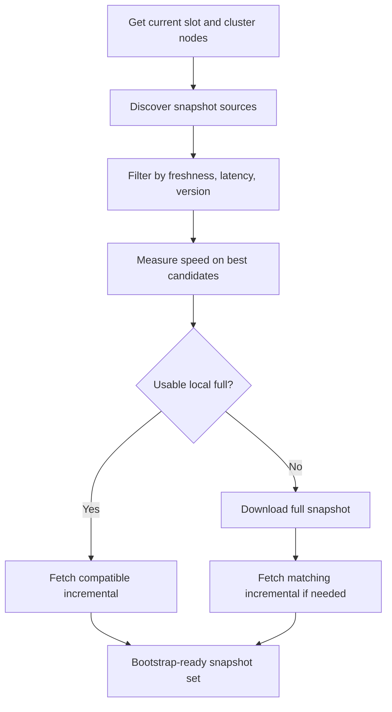

# solana-snapshot-finder

Fast snapshot discovery and download for Solana validators.

`solana-snapshot-finder` finds public RPC snapshot sources, filters them by freshness and latency, checks real download speed, and downloads a bootstrap-ready full + incremental snapshot set.

It is meant for operators who want more control than the validator’s built-in snapshot fetch path, especially during bootstrap and recovery.

## Why use it

- Discovers snapshot sources dynamically from cluster RPC nodes
- Measures real transfer speed before choosing a source
- Enforces minimum speed during the real download
- Supports separate full and incremental archive directories
- Reuses a fresh local full snapshot when possible
- Tries to finish recovery itself instead of leaving missing incremental work to the validator

## How it works



## Core behavior

- `--snapshots` is the primary path flag
- `-u` / `--url` is the primary cluster RPC flag
- `--maximum-local-snapshot-age` decides whether a local full snapshot is still reusable
- Older remote full snapshots may still be considered if they can be paired with a fresh enough incremental
- If a full snapshot is downloaded and its incremental disappears, the tool searches for a compatible replacement incremental
- If a full snapshot has already been downloaded in the current run, the tool stays on that base and avoids downloading a second full in the same pass
- Failing RPCs can be kept in a temporary runtime `blacklist.json`

## Installation

```bash
git clone https://github.com/1dad-io/solana-snapshot-finder.git
cd solana-snapshot-finder
python3 -m venv venv
source venv/bin/activate
pip install -r requirements.txt
```

Ubuntu packages:

```bash
sudo apt-get update
sudo apt-get install -y python3-venv git
```

## Quick start

Store everything in one snapshots directory:

```bash
python3 snapshot-finder.py --snapshots snapshots
```

Store full and incremental archives separately:

```bash
python3 snapshot-finder.py \
  --snapshots snapshots \
  --full-snapshot-archive-path snapshots/full \
  --incremental-snapshot-archive-path snapshots/incremental
```

Use a specific cluster RPC:

```bash
python3 snapshot-finder.py \
  --snapshots snapshots \
  --url https://api.mainnet-beta.solana.com
```

Prefer newer snapshots and stricter latency:

```bash
python3 snapshot-finder.py \
  --snapshots snapshots \
  --maximum-local-snapshot-age 800 \
  --max-latency 60
```

Require faster download sources:

```bash
python3 snapshot-finder.py \
  --snapshots snapshots \
  --min-download-speed 100 \
  --measurement-time 5 \
  --slow-download-abort-time 15
```

## Important flags

### Paths
- `--snapshots` — primary snapshots directory
- `--snapshot-path` — legacy alias for `--snapshots`
- `--full-snapshot-archive-path` — directory for full snapshots
- `--incremental-snapshot-archive-path` — directory for incremental snapshots

### Cluster and discovery
- `-u`, `--url` — RPC endpoint used for cluster discovery and current-slot lookup
- `--rpc-address` — legacy alias for `--url`
- `--with-private-rpc` — also probe private RPC guesses derived from gossip
- `--internal-rpc-nodes` — extra RPC endpoints to include directly

### Selection
- `--slot` — target a specific full snapshot slot
- `--maximum-local-snapshot-age` — reuse a local full snapshot if it is still fresh enough
- `--max-snapshot-age` — legacy alias for `--maximum-local-snapshot-age`
- `--version` — exact or wildcard validator version filter
- `--sort-order` — `latency` or `slots_diff`

### Speed and timeouts
- `--min-download-speed` — minimum measured download speed in MB/s
- `--max-latency` — maximum acceptable RPC latency in ms
- `--measurement-time` — speed probe duration in seconds
- `--slow-download-abort-time` — abort a slow real download after this many seconds
- `--newer-snapshot-timeout` — overall search budget in seconds
- `--threads-count` — concurrent RPC probes
- `--runtime-blacklist-ttl` — keep failing RPCs in `blacklist.json` for this many seconds

## Output

The tool writes:
- `snapshot-finder.log`
- `snapshot.json`
- `blacklist.json` when runtime blacklisting is enabled
- full archives in `--full-snapshot-archive-path`
- incremental archives in `--incremental-snapshot-archive-path`

## Notes

- Incomplete downloads are kept as `.part` until the transfer completes
- The tool enforces `--min-download-speed` both during probing and during the real download
- If a reusable local full snapshot exists, the tool switches to incremental-only recovery for that base
- If an incremental disappears after a long full download, the tool can rescan and try a replacement incremental instead of restarting from scratch
- The search uses a global time budget, but once a full download has already completed, the tool still tries to finish recovery for that chosen base

## Docker

```bash
docker build -t solana-snapshot-finder .
docker run --rm -it -v /mnt/snap:/snapshots --user "$(id -u):$(id -g)" solana-snapshot-finder
```

## License

See the repository license file.
